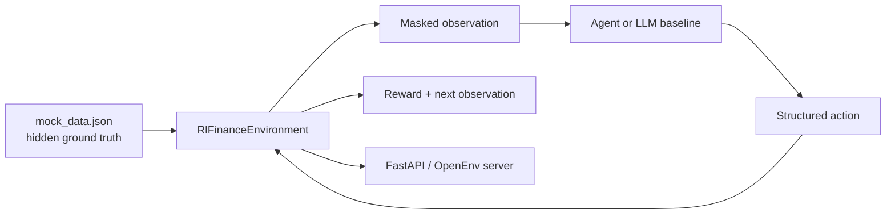

# RL Finance Manager

RL Finance Manager is an OpenEnv-compatible reinforcement learning environment for personal finance workflows. It simulates a bank account with masked transaction history and asks an agent to complete useful finance tasks such as transaction categorization, duplicate charge detection, and budget-cut recommendations.

This project turns personal finance reasoning into a structured environment with:

- a defined observation space
- a constrained action space
- deterministic reward signals
- a repeatable evaluation loop
- an LLM-driven baseline runner for quick experimentation

The repo currently contains the environment, server, data schema, a root-level submission inference script, and deployment assets. It is best understood as an evaluation sandbox for finance agents rather than a polished consumer app.

## Why This Project

Personal finance assistants often look impressive in chat, but they are hard to evaluate consistently. RL Finance Manager frames the problem as an environment where agents must act on incomplete financial data and earn rewards for correct, auditable decisions.

That makes it useful for:

- benchmarking agent behavior on finance tasks
- testing structured tool use instead of free-form text answers
- comparing models on the same transaction history
- creating a foundation for future RL training and evaluation

## What It Does

The environment loads a mock bank statement with **100 transactions** spanning salary, groceries, transport, dining, shopping, subscriptions, utilities, health, housing, entertainment, and SaaS.

The agent does **not** see the hidden ground-truth labels. Instead, it receives:

- current account balance
- a paginated list of recent transactions
- the current task objective
- page metadata
- whether the previous action failed

The agent can respond with one of four structured actions:

- `Categorize`
- `FlagDuplicate`
- `SuggestCut`
- `NextPage`

## Hackathon Highlights

- Converts personal finance assistance into a measurable RL-style environment.
- Uses hidden labels and deterministic grading for reproducible evaluation.
- Exposes the environment through FastAPI/OpenEnv for local use or deployment.
- Includes an LLM baseline runner that can be swapped across models.
- Keeps the task realistic by exposing only masked transaction views to the agent.

## Task Modes

| Mode | Objective | Success Condition |
| --- | --- | --- |
| `easy` | Categorize a transaction correctly | Correct category assignment |
| `medium` | Detect and flag a duplicate subscription charge | Correct duplicate identified |
| `hard` | Recommend a concrete spending cut | Correct category and percentage |
| `random` | Randomly selects one of the above | Depends on sampled task |

## Reward Design

The environment uses small penalties for bad actions and positive rewards for correct decisions.

- `Categorize`: positive reward for a correct category, penalty for wrong or malformed actions
- `FlagDuplicate`: full success reward for the correct duplicate, penalty for wrong guesses
- `SuggestCut`: full success reward for the correct savings recommendation
- `NextPage`: small penalty for moving to the next page, larger penalty for trying to scroll past the end
- Episodes terminate on success or when the step budget is exhausted

Current environment settings in code:

- page size: `10` transactions
- maximum steps: `30`
- mock starting balance: `5430.00`

## How It Works



## Tech Stack

- Python
- FastAPI
- OpenEnv / `openenv-core`
- Pydantic
- Uvicorn
- OpenAI Python SDK
- `python-dotenv`
- OpenAI-compatible LLM endpoints such as Hugging Face Router or Groq
- Docker for packaging and deployment

## Repository Structure

```text
.
├── README.md
├── LICENSE
├── inference.py
└── rl_finance
    ├── client.py
    ├── Dockerfile
    ├── inference.py
    ├── mock_data.json
    ├── models.py
    ├── openenv.yaml
    ├── pyproject.toml
    ├── README.md
    ├── requirements.txt
    ├── uv.lock
    └── server
        ├── app.py
        └── rl_finance_environment.py
```

## Core Components

- `rl_finance/server/rl_finance_environment.py` - Main environment that loads the dataset, masks transaction truth, handles pagination, grades actions, and returns rewards.
- `rl_finance/models.py` - Pydantic models for actions, observations, transactions, and anomaly metadata.
- `rl_finance/server/app.py` - FastAPI/OpenEnv wrapper that exposes HTTP and WebSocket endpoints.
- `rl_finance/inference.py` - Baseline runner that prompts an LLM to act inside the environment using structured JSON outputs.
- `rl_finance/mock_data.json` - Mock transaction dataset used for evaluation.

## Getting Started

### Prerequisites

- Python `3.10+`
- `uv` for environment management
- An API key for an OpenAI-compatible endpoint if you want to run the LLM baseline
- Docker only if you want to containerize or deploy the project

### Install Dependencies

From the repository root:

```bash
cd rl_finance
uv sync
uv pip install -r requirements.txt
```

Why both steps?

- `uv sync` installs the environment/server dependencies from `pyproject.toml`
- `requirements.txt` adds the inference-time packages such as `openai`

## Run the Environment Server

```bash
cd rl_finance
uv run server --port 8000
```

Alternative development command:

```bash
cd rl_finance
uv run uvicorn server.app:app --reload --host 0.0.0.0 --port 8000
```

Once running, the main endpoints are:

- `http://localhost:8000/docs`
- `http://localhost:8000/health`
- `http://localhost:8000/ws`

Depending on the OpenEnv setup, a web UI can also be exposed at `/web`.

## Run the LLM Baseline

The submission baseline script is [inference.py](/home/redark/Documents/RL-FinanceManager/inference.py). It uses the OpenAI Python client and reads provider settings from environment variables.

The root-level wrapper is intentionally defensive: if environment setup or imports fail before the main runner starts, it still emits a minimal `[START]`, `[STEP]`, and `[END]` block to stdout so grader-visible startup failures are easier to diagnose.

Example `.env` at the repository root or in `rl_finance/`:

```bash
API_BASE_URL="https://api.groq.com/openai/v1"
API_KEY="your_api_key_here"
MODEL_NAME="openai/gpt-oss-120b"
```

For compatibility with older local setups, the script also accepts `OPENAI_API_KEY` or `HF_TOKEN` if `API_KEY` is not set.

Then run from the repository root:

```bash
python inference.py --task-mode easy
```

By default, `python inference.py` runs the `easy` task so stdout contains one clean episode for validator-friendly parsing.

To evaluate all built-in tasks in one run:

```bash
python inference.py --task-mode all
```

Supported task modes:

- `easy`
- `medium`
- `hard`
- `random`
- `all`

Additional runtime configuration:

- `API_KEY`: preferred API key variable for the OpenAI client and the variable injected by the grader's LiteLLM proxy
- `OPENAI_API_KEY`: fallback API key variable for compatibility
- `HF_TOKEN`: fallback API key variable for compatibility
- `MODEL_NAME`: optional, defaults to `openai/gpt-oss-120b`
- `API_BASE_URL`: optional, defaults to `https://router.huggingface.co/v1`
- `TASK_MODE`: optional unless you pass `--task-mode`; defaults to `easy`

If you prefer shell exports instead of `.env`, you can still run:

```bash
export API_BASE_URL="https://api.groq.com/openai/v1"
export API_KEY="your_api_key_here"
export MODEL_NAME="openai/gpt-oss-120b"
python inference.py --task-mode all
```

The script prints one episode at a time using the required format:

```text
[START] task=<task_name> env=rl_finance model=<model_name>
[STEP] step=<n> action=<action_str> reward=<0.00> done=<true|false> error=<raw_error|null>
[END] success=<true|false> steps=<n> score=<score> rewards=<r1,r2,...,rn>
```

## Baseline Scores

Record the reproducible baseline scores from `python inference.py --task-mode all` before submission and paste them here:

| Task | Model | Score |
| --- | --- | --- |
| `easy` | `openai/gpt-oss-120b` | `0.10` |
| `medium` | `openai/gpt-oss-120b` | `1.00` |
| `hard` | `openai/gpt-oss-120b` | `1.00` |

## Deployment

This repo already includes the files needed for OpenEnv-style deployment:

- `rl_finance/Dockerfile`
- `rl_finance/openenv.yaml`

To build locally:

```bash
cd rl_finance
docker build -t rl-finance-env .
```

To push with OpenEnv tooling:

```bash
env PATH="/home/redark/.local/bin:$PATH" hf auth login
env PATH="/home/redark/.local/bin:$PATH" hf auth whoami
cd rl_finance
./.venv/bin/openenv push --repo-id YOUR_USERNAME/rl-finance-manager
```

## What Makes It RL-Friendly

- The agent operates under partial information.
- The action space is discrete and structured.
- Rewards are immediate and deterministic.
- Episodes have a defined reset and termination condition.
- The environment now exposes `reset()`, `step()`, and `state()`.
- The environment can support repeated evaluation across models or policies.

## Current Limitations

- The dataset is mock data, not live financial data.
- The project includes an LLM baseline runner, not a trained RL policy.
- There is no automated test suite in the repository yet.
- Baseline scores depend on the configured model and endpoint, so rerun them if you change `MODEL_NAME` or `API_BASE_URL`.

## Future Roadmap

- Expand the dataset with richer anomaly patterns and broader merchant coverage.
- Add more finance tasks such as fraud triage, recurring-payment audits, and cash-flow forecasting.
- Benchmark multiple agent models on the same environment.
- Add evaluation metrics, leaderboard tooling, and experiment tracking.
- Build a lightweight frontend for visual review of decisions and rewards.

## License

This project is released under the **MIT License**. See [LICENSE](LICENSE).
